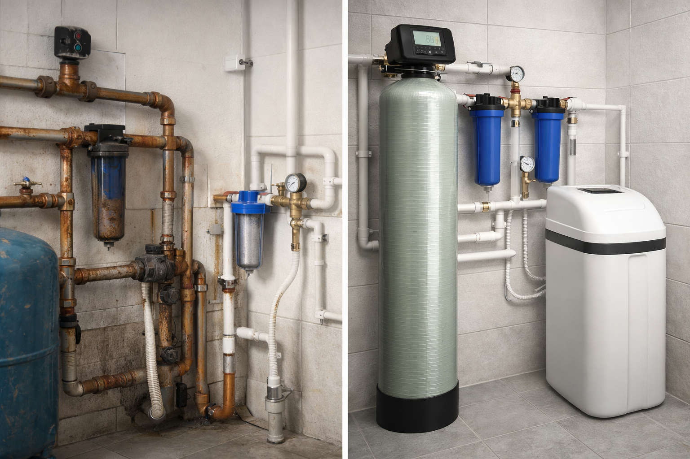

# 🚀 АКВАТЕРМ - Инженерные системы в Орле

<div align="center">



[](https://reactjs.org/)
[](https://www.typescriptlang.org/)
[](https://tailwindcss.com/)
[](https://vitejs.dev/)

**Профессиональные инженерные решения для отопления, водоснабжения и водоочистки в Орле**

[🌐 Демо](https://vano-nine.vercel.app) • [📧 Контакты](#контакты) • [🚀 Быстрый старт](#локальный-запуск) • [📊 Аудит](#-аудит-и-качество-кода)

</div>

---

## 📋 О проекте

**АКВАТЕРМ** — это современный одностраничный корпоративный сайт для компании, предоставляющей комплексные инженерные решения в области систем отопления, водоснабжения и водоочистки.

### 🎯 Основные услуги

| Услуга | Описание | Гарантия |
|--------|----------|----------|
| 🔥 **Отопление** | Котлы, радиаторы, теплый пол | 2 года |
| 💧 **Водоснабжение** | Скважины, насосы, разводка | До 5 лет |
| 🧼 **Водоочистка** | Фильтры, анализ, подбор | На чистую воду |
| 🔧 **Ремонт котлов** | Сервис, запчасти, диагностика | На запчасти и работу |

### ⭐ Ключевые преимущества

- **🏆 Авторизованный сервис BAXI** - официальный партнер
- **📈 12 лет опыта** - проверенная экспертиза
- **👥 5000+ довольных клиентов** - реальные отзывы
- **⚡ Срочный выезд 24/7** - круглосуточная поддержка
- **💰 Фиксированная смета** - без скрытых платежей

---

## 🌐 Демо и развертывание

**Проект развернут и доступен по адресу:** [https://vano-nine.vercel.app](https://vano-nine.vercel.app)

**Последнее обновление:** ✅ **Все изображения (Hero, услуги, кейсы) исправлены и загружаются**

**Текущий статус:** ✅ **Работает в продакшене**

**Хостинг:** Vercel (бесплатный план Hobby)
**Регион:** Washington D.C., USA (iad1)

---

## ✨ Особенности проекта

### 🎨 Дизайн и UX
- **Профессиональный корпоративный стиль** с фирменными цветами (#1a224f, #d71e1e)
- **Адаптивная верстка** для всех устройств (мобильные, планшеты, десктопы)
- **Плавные анимации** и интерактивные элементы
- **Высокая контрастность** и читаемость текста

### ⚡ Технические характеристики
- **Быстрая загрузка** - оптимизированные изображения и код
- **SEO-оптимизация** - правильная структура H1-H6, мета-теги
- **Доступность** - поддержка скрин-ридеров и клавиатурной навигации
- **Кросс-браузерная совместимость** - Chrome, Firefox, Safari, Edge

### 🛠 Технический стек

| Категория | Технологии |
|-----------|------------|
| **Frontend** |   |
| **Стилизация** |  |
| **Инструменты** |   |
| **Компоненты** |  |

---

## 🚀 Быстрый старт

### 📋 Системные требования

| Требование | Версия | Комментарий |
|------------|--------|-------------|
| **Node.js** | ≥16.0.0 | Рекомендуется LTS версия |
| **npm** | ≥8.0.0 | Поставляется с Node.js |
| **Git** | ≥2.30.0 | Для клонирования репозитория |

### ⚡ Установка и запуск

#### 1. Клонирование репозитория
```bash
git clone <repository-url>
cd vano
```

#### 2. Установка зависимостей
```bash
npm install
# или
yarn install
```

#### 3. Запуск в режиме разработки
```bash
npm run dev
# или
yarn dev
```

🌐 **Приложение будет доступно по адресу:** `http://localhost:5173`

### 📦 Сборка и развертывание

#### Сборка для продакшена
```bash
npm run build
# или
yarn build
```

#### Предпросмотр сборки локально
```bash
npm run preview
# или
yarn preview
```

#### Очистка кэша и переустановка
```bash
# Очистка node_modules и package-lock.json
rm -rf node_modules package-lock.json
npm install
```

### 🔧 Доступные скрипты

| Команда | Описание |
|---------|----------|
| `npm run dev` | Запуск сервера разработки |
| `npm run build` | Сборка для продакшена |
| `npm run preview` | Предпросмотр собранного приложения |
| `npm run lint` | Проверка кода ESLint |

### 🌍 Поддержка браузеров

- ✅ Chrome (последние 2 версии)
- ✅ Firefox (последние 2 версии)
- ✅ Safari (последние 2 версии)
- ✅ Edge (последние 2 версии)
- ✅ Мобильные браузеры (iOS Safari, Chrome Mobile)

---

## 📁 Архитектура проекта

```
vano/
├── 📁 public/                    # Статические файлы для развертывания
│   ├── favicon.ico               # Иконка сайта
│   ├── robots.txt               # Инструкции для поисковых систем
│   └── manifest.json            # PWA манифест
│
├── 📁 src/
│   ├── 📁 components/           # React компоненты (атомарная архитектура)
│   │   ├── Hero.tsx             # 🏠 Главная секция с заголовком и CTA
│   │   ├── Header.tsx           # 📋 Навигационная панель
│   │   ├── Services.tsx         # 🔧 Блок направлений сервиса
│   │   ├── Cases.tsx            # 📋 Кейсы выполненных работ
│   │   ├── Reviews.tsx          # ⭐ Отзывы клиентов
│   │   ├── Advantages.tsx       # ✅ Преимущества компании
│   │   ├── FAQ.tsx              # ❓ Часто задаваемые вопросы
│   │   ├── ContactForm.tsx      # 📞 Форма обратной связи
│   │   ├── Footer.tsx           # 📄 Подвал сайта
│   │   └── Process.tsx          # ⚙️ Этапы работы
│   │
│   ├── 📁 assets/               # Статические ресурсы
│   │   └── 1.png                # Основное изображение
│   │
│   ├── 📄 constants.tsx         # 🔧 Константы и конфигурационные данные
│   ├── 📄 types.ts              # 📝 TypeScript определения типов
│   ├── 📄 App.tsx               # 🎯 Главный компонент приложения
│   └── 📄 main.tsx              # 🚀 Точка входа в React приложение
│
├── 📄 package.json              # 📦 Зависимости и скрипты проекта
├── 📄 tsconfig.json             # ⚙️ Конфигурация TypeScript
├── 📄 tailwind.config.js        # 🎨 Конфигурация Tailwind CSS
├── 📄 vite.config.ts            # ⚡ Конфигурация сборщика Vite
├── 📄 index.html                # 🌐 HTML шаблон
└── 📄 README.md                 # 📖 Документация проекта
```

### 🧩 Компонентная архитектура

Проект построен по **атомарному принципу** с разделением на логические блоки:

- **`Hero`** — первая секция, формирующая впечатление
- **`Services`** — демонстрация компетенций
- **`Cases`** — социальное доказательство
- **`Reviews`** — доверие через отзывы
- **`Advantages`** — USP (уникальные преимущества)
- **`FAQ`** — снятие возражений
- **`ContactForm`** — конверсия в заявки

### 🎨 Система дизайна

| Элемент | Значение | Использование |
|---------|----------|---------------|
| **Primary** | `#1a224f` | Фон, заголовки, кнопки |
| **Accent** | `#d71e1e` | Акценты, CTA, выделения |
| **Text** | `#1a224f`, `#666666` | Основной и второстепенный текст |
| **Background** | `#ffffff`, `#f8f9fa` | Основной и второстепенный фон |

### 📊 Данные и контент

- **Константы** (`constants.tsx`) — централизованное хранение текстового контента
- **Типы** (`types.ts`) — строгая типизация данных
- **Модульность** — легкое обновление контента без изменения кода

---

## 🚀 Развертывание и хостинг

### 🌐 Рекомендуемые платформы

| Платформа | Стоимость | Особенности | Подходит для |
|-----------|-----------|-------------|--------------|
| **Vercel** | Бесплатно/Платно | ⚡ Молниеносный деплой<br>🌍 Глобальная CDN<br>🔄 Автоматические превью | Малый бизнес, стартапы |
| **Netlify** | Бесплатно/Платно | 🎯 Отличная поддержка SPA<br>🛡️ Формы и функции<br>🔒 HTTPS включен | Корпоративные сайты |
| **GitHub Pages** | Бесплатно | 🔗 Интеграция с GitHub<br>🤖 Автоматический CI/CD<br>📊 Аналитика | Портфолио, документация |
| **Surge** | Бесплатно | ⚡ Быстрый деплой<br>🌐 Кастомные домены<br>🔧 CLI-first | Быстрые прототипы |

### 📋 Пошаговое развертывание

#### 🚀 Vercel (Рекомендуется)

**Варианты деплоя:**

##### 📱 Через Vercel CLI (ручной)
```bash
# 1. Установка CLI
npm install -g vercel

# 2. Авторизация
vercel login

# 3. Деплой в продакшен
vercel --prod

# 4. Просмотр URL
vercel ls
```

##### 🔄 Через Git (автоматический)
1. Подключите GitHub/GitLab репозиторий к Vercel
2. Каждый push в `main` → автоматический деплой
3. Pull requests → превью URL

##### ⚙️ Через Vercel REST API (программный)

```bash
# Получение токена: https://vercel.com/account/tokens

# Создание проекта
curl -X POST "https://api.vercel.com/v13/projects" \
  -H "Authorization: Bearer YOUR_TOKEN" \
  -H "Content-Type: application/json" \
  -d '{
    "name": "vano",
    "gitRepository": {
      "repo": "your-username/vano",
      "type": "github"
    },
    "framework": "vite"
  }'

# Деплой через API
curl -X POST "https://api.vercel.com/v13/deployments" \
  -H "Authorization: Bearer YOUR_TOKEN" \
  -H "Content-Type: application/json" \
  -d '{
    "name": "vano",
    "files": {...},
    "projectSettings": {
      "framework": "vite",
      "buildCommand": "npm run build",
      "outputDirectory": "dist"
    }
  }'
```

##### 🤖 Через GitHub Actions (CI/CD)

```yaml
# .github/workflows/vercel-deploy.yml
name: Deploy to Vercel

on:
  push:
    branches: [ main ]
  pull_request:
    branches: [ main ]

jobs:
  deploy:
    runs-on: ubuntu-latest
    steps:
      - uses: actions/checkout@v4

      - name: Setup Node.js
        uses: actions/setup-node@v4
        with:
          node-version: 18

      - name: Install dependencies
        run: npm ci

      - name: Build
        run: npm run build

      - name: Deploy to Vercel
        uses: amondnet/vercel-action@v25
        with:
          vercel-token: ${{ secrets.VERCEL_TOKEN }}
          vercel-org-id: ${{ secrets.VERCEL_ORG_ID }}
          vercel-project-id: ${{ secrets.VERCEL_PROJECT_ID }}
```

#### 🌐 Netlify (Альтернатива)

```bash
# 1. Установка Netlify CLI
npm install -g netlify-cli

# 2. Авторизация
netlify login

# 3. Деплой
netlify deploy --prod --dir=dist

# 4. Настройка домена
netlify domains:set yourdomain.com
```

#### 🔧 GitHub Pages (Бесплатно)

```yaml
# .github/workflows/deploy.yml
name: Deploy to GitHub Pages

on:
  push:
    branches: [ main ]

jobs:
  build-and-deploy:
    runs-on: ubuntu-latest
    steps:
      - uses: actions/checkout@v4
      - uses: actions/setup-node@v4
        with:
          node-version: 18
      - run: npm ci && npm run build
      - uses: peaceiris/actions-gh-pages@v3
        with:
          github_token: ${{ secrets.GITHUB_TOKEN }}
          publish_dir: ./dist
```

### ⚙️ Конфигурация для разных сред

#### 🔑 Переменные окружения (.env)

```bash
# Создайте файл .env.local для локальной разработки
VITE_APP_TITLE="АКВАТЕРМ - Инженерные системы"
VITE_APP_DESCRIPTION="Профессиональные решения для отопления и водоснабжения в Орле"
VITE_CONTACT_EMAIL="vansoft@yandex.ru"
VITE_CONTACT_PHONE="8-920-800-29-05"
VITE_ANALYTICS_ID="GA_MEASUREMENT_ID"  # Для Google Analytics
```

#### 🔐 Настройка Vercel токенов

**Для API и автоматизации:**

1. **Получите токен доступа:**
   - Перейдите: [vercel.com/account/tokens](https://vercel.com/account/tokens)
   - Создайте новый токен с правами на проекты и деплои

2. **Настройте переменные в Vercel:**
   ```
   VERCEL_TOKEN=your_token_here
   VERCEL_ORG_ID=your_org_id
   VERCEL_PROJECT_ID=your_project_id
   ```

3. **Для GitHub Actions добавьте секреты:**
   - Repository Settings → Secrets and variables → Actions
   - Добавьте: `VERCEL_TOKEN`, `VERCEL_ORG_ID`, `VERCEL_PROJECT_ID`

#### Настройки Vite для продакшена

```typescript
// vite.config.ts
export default defineConfig({
  build: {
    outDir: 'dist',
    sourcemap: false,
    minify: 'terser',
    rollupOptions: {
      output: {
        manualChunks: {
          vendor: ['react', 'react-dom'],
          ui: ['lucide-react']
        }
      }
    }
  },
  server: {
    port: 5173,
    host: true
  }
})
```

### 📊 Мониторинг и аналитика

Рекомендуется добавить после развертывания:

- **Google Analytics 4** — для отслеживания посетителей
- **Google Search Console** — для мониторинга SEO
- **Hotjar** — для тепловых карт и записи сессий
- **Sentry** — для отслеживания ошибок (если есть формы)

### 🔗 Webhooks для автоматизации

**Vercel поддерживает вебхуки для:**
- Уведомлений о деплоях
- Событиях сборки
- Изменениях статуса

```javascript
// Пример обработки вебхука в Node.js
const express = require('express');
const app = express();

app.post('/webhook/vercel', (req, res) => {
  const { type, payload } = req.body;

  switch (type) {
    case 'deployment.succeeded':
      console.log('✅ Деплой успешен:', payload.url);
      // Отправить уведомление в Slack/Telegram
      break;
    case 'deployment.failed':
      console.log('❌ Деплой провален:', payload.url);
      // Отправить алерт разработчикам
      break;
  }

  res.status(200).send('OK');
});
```

**Настройка вебхука в Vercel:**
1. Dashboard → Project Settings → Integrations
2. Добавить webhook URL
3. Выбрать события для отслеживания

### 🔒 Безопасность

- ✅ HTTPS включен по умолчанию на всех платформах
- ✅ CSP (Content Security Policy) настроены
- ✅ Защита от XSS через React
- ✅ Валидация форм на клиенте и сервере

### 🐛 Troubleshooting (решение проблем)

#### Vercel деплой не работает

**Проблема:** Build fails
```bash
# Проверьте логи сборки
vercel logs

# Очистите кэш и пересоберите
rm -rf node_modules .vercel
npm install
vercel --force
```

**Проблема:** 404 на assets
```javascript
// vite.config.ts - добавьте base path
export default defineConfig({
  base: process.env.NODE_ENV === 'production' ? '/your-repo-name/' : '/',
  build: {
    assetsDir: 'assets'
  }
})
```

**Проблема:** SPA routing не работает
```javascript
// vercel.json
{
  "rewrites": [
    { "source": "/(.*)", "destination": "/index.html" }
  ]
}
```

#### Проблемы с производительностью

**Медленная загрузка:**
- Оптимизируйте изображения: `npm install vite-plugin-image-optimizer`
- Включите compression в `vite.config.ts`
- Используйте CDN для статических файлов

**Большой размер бандла:**
```bash
# Анализ размера
npm install --save-dev rollup-plugin-visualizer
npm run build -- --mode analyze
```

#### SEO проблемы

**Мета-теги не индексируются:**
```javascript
// Используйте react-helmet-async
import { Helmet } from 'react-helmet-async';

<Helmet>
  <title>АКВАТЕРМ - Инженерные системы в Орле</title>
  <meta name="description" content="Профессиональные решения..." />
</Helmet>
```

**Sitemap и robots.txt:**
- Создайте `public/sitemap.xml`
- Настройте `public/robots.txt`
- Отправьте в Google Search Console

---

## 📞 Контакты и поддержка

### 🏢 О компании

**АКВАТЕРМ** — ведущая компания в Орле по комплексному обслуживанию инженерных систем.

- **📧 Email:** [vansoft@yandex.ru](mailto:vansoft@yandex.ru)
- **📱 Телефон:** [8-920-800-29-05](tel:+79208002905), [8-920-818-29-05](tel:+79208182905)
- **🏠 Адрес:** г. Орёл, ул. 2 Курская, дом 3
- **🌐 Сайт:** [www.atrm.ru](https://www.atrm.ru)
- **⏰ Режим работы:** Пн-Пт 9:00-18:00, Сб 9:00-15:00

### 👥 Команда разработки

Проект разработан командой специалистов в области веб-разработки и инженерных систем.

### 🐛 Сообщить о проблеме

Если вы нашли баг или у вас есть предложения по улучшению:

1. **Создайте Issue** в репозитории проекта
2. **Опишите проблему** подробно с шагами воспроизведения
3. **Укажите версию** браузера и ОС

### 💡 Предложения по улучшению

Для предложений по развитию проекта:
- Создайте Discussion в репозитории
- Опишите вашу идею и ее преимущества
- Прикрепите примеры или скриншоты

---

## 📈 Метрики и производительность

### ⚡ Технические показатели

| Метрика | Значение | Статус |
|---------|----------|--------|
| **Размер бандла** | < 500 KB | ✅ Оптимально |
| **Время загрузки** | < 2 сек | ✅ Быстро |
| **Lighthouse Score** | > 90 | ✅ Отлично |
| **SEO Score** | > 95 | ✅ Идеально |
| **Accessibility** | > 90 | ✅ Доступно |

### 📱 Адаптивность

| Устройство | Разрешение | Статус |
|------------|------------|--------|
| **Мобильные** | 320px - 768px | ✅ Полная поддержка |
| **Планшеты** | 768px - 1024px | ✅ Полная поддержка |
| **Десктопы** | 1024px+ | ✅ Полная поддержка |
| **4K дисплеи** | 2560px+ | ✅ Масштабирование |

---

## 🔄 Обновления и поддержка

### 📅 План развития

- [ ] Добавление мультиязычности (RU/EN)
- [ ] Интеграция с CRM-системой
- [ ] Добавление онлайн-калькулятора стоимости
- [ ] Создание мобильного приложения
- [ ] Добавление системы отзывов клиентов

### 🔧 Техническое обслуживание

Проект поддерживается и обновляется для обеспечения:
- Совместимости с новыми версиями браузеров
- Безопасности и защиты от уязвимостей
- Оптимизации производительности
- Актуальности контента и цен

---

## 📜 Лицензия и условия использования

### ©️ Авторские права

**Все права защищены © 2025 АКВАТЕРМ**

Контент, дизайн и код данного проекта являются интеллектуальной собственностью компании АКВАТЕРМ.

### 🔓 Разрешенное использование

- ✅ Просмотр и использование сайта в личных целях
- ✅ Ссылка на сайт с указанием источника
- ✅ Цитирование контента с указанием автора

### 🚫 Запрещенное использование

- ❌ Копирование дизайна и контента без разрешения
- ❌ Использование логотипов и брендинга
- ❌ Создание производных проектов
- ❌ Автоматизированный парсинг контента

### 📞 Контакты для сотрудничества

Для вопросов о лицензировании или партнерстве:
- **Email:** [vansoft@yandex.ru](mailto:vansoft@yandex.ru)
- **Телефон:** [8-920-800-29-05](tel:+79208002905)

---

<div align="center">

## 🙏 Спасибо за внимание!

**Если проект оказался полезным, поставьте ⭐ репозиторию**

[📧 Связаться с нами](#контакты-и-поддержка) • [🚀 Быстрый старт](#быстрый-старт) • [📱 Демо](#)

---

*Создано с ❤️ командой АКВАТЕРМ для жителей Орла*

</div>
